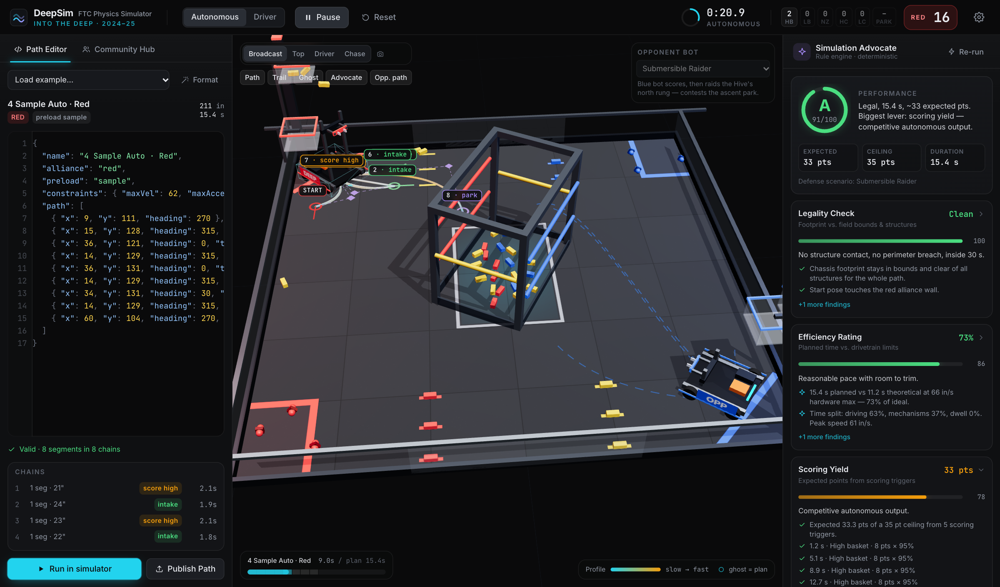

# DeepSim · FTC *Into The Deep* physics simulator

[](https://github.com/ishaanjayaswal-dotcom/deepsim-ftc/actions/workflows/ci.yml)
[](LICENSE)

A 3D, browser-based physics simulator for the FIRST Tech Challenge 2024–25 season, *Into The Deep*. Write a
Pedro-Pathing-style autonomous path, run it on a physically simulated mecanum robot, get it graded by a deterministic
rule engine, and share it with other teams on the community hub.

**[Try the live demo →](https://ishaanjayaswal-dotcom.github.io/deepsim-ftc/)** (the demo is static, so its hub saves
paths in your browser; run the server to share them)



## Features

- **Real physics.** Rapier rigid bodies at 120 Hz: a mecanum drivetrain with a motor torque curve and a traction
  circle, a submersible that tilts on spring hinges, and samples and specimens you can push, pick, shoot and clip.
- **Pedro-Pathing-style paths.** Lines and Béziers with any number of control points, heading interpolation,
  velocity and acceleration limits, waits and actions. The editor takes JSON, relaxed JSON or a pasted data string.
- **Simulation Advocate.** A deterministic grader that scores legality, efficiency, expected points and defense
  exposure against a scripted opponent, and marks problems on the field.
- **Community hub.** Publish paths with your team number, search, filter, upvote, and execute anyone's path in one
  click. Only the browser that published a path can edit or delete it.
- **Driver mode.** Drive the robot yourself with the keyboard to feel what your auto is asking for.

## Quick start

Needs Node.js 22 or newer.

```bash
git clone https://github.com/ishaanjayaswal-dotcom/deepsim-ftc.git
cd deepsim-ftc
npm install
npm run dev          # web app on http://localhost:5188, API on :8787
```

No database to install: the server creates a SQLite file in `data/` on first start and seeds a few starter paths.

| Command | What it does |
| --- | --- |
| `npm run dev` | Vite dev server and the API server with reload |
| `npm run build` | Typecheck everything, build the web app to `dist/` and the server to `server/dist/` |
| `npm start` | Serve the built app and the API on one port (default http://127.0.0.1:8787) |
| `npm test` | Path compiler, follower, evaluator and API tests |
| `npm run typecheck` | Typecheck the web app and the server |
| `npm run db:generate` | Generate a new migration after editing `server/src/db/schema.ts` |

### Docker

```bash
docker build -t deepsim .
docker run -p 8787:8787 -v deepsim-data:/app/data deepsim
```

### Static hosting

`npm run build` also produces a plain static site in `dist/`. Hosted without the server (GitHub Pages, Netlify, any
CDN), the app notices there is no API and keeps the hub in the browser's local storage. Build with
`npx vite build --base=/your-sub-path/` when it is served from a sub-path.

## Configuration

All settings are environment variables and all are optional. See [`.env.example`](.env.example).

| Variable | Default | Meaning |
| --- | --- | --- |
| `PORT` | `8787` | Port to listen on |
| `HOST` | `127.0.0.1` | Bind address (`0.0.0.0` in Docker) |
| `DATABASE_URL` | `file:./data/deepsim.db` | libSQL URL: a local SQLite file, or a `libsql://` [Turso](https://turso.tech) database |
| `DATABASE_AUTH_TOKEN` | – | Turso auth token |
| `ADMIN_KEY` | – | Moderator key (16+ characters): `Authorization: Bearer <key>` can edit or delete any path |
| `CORS_ORIGIN` | – | Comma-separated origins allowed to call the API from another site (`*` is not supported) |
| `TRUST_PROXY` | `false` | Take the client IP from the last `X-Forwarded-For` entry. Set it only when the server sits behind exactly one reverse proxy you control |
| `SEED` | `true` | Add the starter paths when the database is empty |
| `STATIC_DIR` | `dist` | Built web app to serve |

The web app finds the API by itself when both are served from the same origin. To point it at an API elsewhere, build
with `VITE_PATHS_API=https://your-host/api`.

## Using the simulator

| Region | What it does |
| --- | --- |
| Left sidebar → **Path Editor** | Highlighted JSON editor with inline errors, examples, Format, chain breakdown, **Run** (⌘/Ctrl+Enter) and **Publish Path** |
| Left sidebar → **Community Hub** | Search, filter by strategy, sort by top or new, upvote, copy the data string, **Execute in Simulator** |
| Centre | The 3D field. Camera presets (Broadcast / Top / Driver / Chase), overlay toggles, opponent picker |
| Right rail → **Simulation Advocate** | Overall grade, four metric cards with findings, live telemetry, event log |

Keys: `P` pause, `R` reset, `C` cycle camera. In Driver mode: `WASD` drive (relative to the camera), `Q`/`E` turn,
`Shift` precision, `Space` intake or drop, `1`/`2` high or low basket, `3`/`4` high or low chamber.

### Path format

Paste a bare array of waypoints or an object. The parser also accepts comments, trailing commas, single quotes,
unquoted keys, a `const path = …;` wrapper, and base64 data strings copied from the hub.

```jsonc
{
  "name": "4 Sample Auto · Red",
  "alliance": "red",            // red | blue
  "preload": "sample",          // sample | specimen | none
  "constraints": { "maxVel": 62, "maxAccel": 75, "maxDecel": 65, "maxAngVel": 260, "lateralAccel": 90 },
  "path": [
    { "x": 9, "y": 111, "heading": 270 },                                   // start pose
    { "x": 15, "y": 128, "heading": 315, "type": "bezier", "controlPoints": [[21, 115]], "action": "score_high" },
    { "x": 36, "y": 121, "heading": 0, "type": "line", "action": "intake" }
  ]
}
```

- **Coordinates** follow Pedro Pathing: inches, origin in a field corner, x and y from 0 to 144, heading in degrees
  counter-clockwise from +x (add `"headingUnits": "rad"` for radians). The red alliance wall is x = 0; red's net zone
  and baskets are at (0, 144) and its observation zone at (0, 0). The field is rotationally symmetric.
- **Segments**: `type` is `line` or `bezier`. A Bézier takes any number of `controlPoints` (`[x, y]` or `{x, y}`).
  Control points without a type mean Bézier.
- **Heading**: `headingInterpolation` is `linear` (default, shortest direction), `tangent`, `reverseTangent` or `constant`.
- **Per waypoint**: `maxVel` caps speed on the segment ending there; `action`, `wait` (seconds) and `stop` force a full
  stop; `extend` sets the intake reach in inches.
- **Actions**: `intake`, `intake_sample`, `intake_specimen`, `score_high`, `score_low`, `specimen_high`,
  `specimen_low`, `park`, `wait`.

Waypoints between two stops form a *chain* (Pedro's PathChain) that the robot flows through without stopping. Each
chain is sampled every 0.5 in and speed-profiled with a forward/backward pass under velocity, acceleration,
deceleration, lateral-acceleration (curvature) and heading-rate limits.

## How it works

- **Robot**: an 18 × 18 in, 14 kg body that only yaws. Wheel friction is zero and the drivetrain is modelled
  explicitly (`src/sim/drivetrain.ts`): a velocity loop, a motor torque–speed curve, mecanum strafe efficiency, and a
  traction circle at μ·g that drops to kinetic friction once the wheels slip. The follower (`src/path/follower.ts`)
  works like Pedro's: it projects onto the closest point of the path, drives along the tangent at the profiled speed,
  and adds translational, centripetal and heading correction. It only asks for a velocity; the physics decides what
  the wheels deliver, so aggressive profiles or low μ give real slip and overshoot (amber trail, cyan ghost).
- **Submersible**: a dynamic body on two spring-loaded revolute hinges (pitch and roll, ±2.6°) that rocks when hit
  or loaded and settles back to level.
- **Game elements**: instanced rigid bodies with continuous collision detection. Held elements become kinematic and
  non-colliding; shots fly a ballistic arc with a deterministic aim error; basket sensors count points; clipped
  specimens ride the tilting submersible.
- **Opponent**: a kinematic replay of a deterministic path with infinite mass, so it really does shove you.

### Simulation Advocate (`src/eval/advocate.ts`)

A pure function of (path, robot, opponent): the same input always gives the same report.

| Metric | How it's computed |
| --- | --- |
| Legality | The robot's footprint (an oriented box) checked at every sample against the field bounds and structures with the separating axis test, plus the starting pose and the 30 s limit |
| Efficiency | Planned time against the hardware minimum; flags curvature-capped distance, detours, idle stops and profiles that ask for more traction than the tiles have |
| Scoring yield | Replays the action timeline against the real element layout with the runtime's reach rules (`src/lib/rules.ts`) |
| Defense | Steps both robots through time to find contacts, contested time (within 8 in), pinch points and lane crossings |

The overall grade weights legality 30%, efficiency 20%, yield 30% and defense 20%. Hub cards are always graded
against the *Raider* opponent so they compare like for like.

## API

The server is [Hono](https://hono.dev) + [Drizzle ORM](https://orm.drizzle.team) on libSQL. Every route lives under
`/api`; bodies are JSON; errors are `{ "error": "message" }`. Wire types are in [`src/repo/types.ts`](src/repo/types.ts).

| Method | Route | Notes |
| --- | --- | --- |
| GET | `/api/health` | `{ ok: true, version }` |
| GET | `/api/paths?q=&category=&sort=new\|top&limit=&offset=` | `PathSummary[]`: every field except the path source `data` |
| GET | `/api/paths/:id` | `PathRecord`, including `data` |
| POST | `/api/paths` | Body: `name`, `teamNumber`, `category`, `description`, `data`. Returns `201` with the record and a one-time `editKey` |
| PATCH | `/api/paths/:id` | Header `X-Edit-Key`. Any of the create fields |
| DELETE | `/api/paths/:id` | Header `X-Edit-Key`. `204` |
| POST | `/api/paths/:id/upvote` | Header `X-Voter-Id` (an anonymous per-browser id). One vote per voter |

The server recomputes each path's thumbnail, length, duration and grade from its source, so cards can't be faked. Paths must stay near the field (coordinates from −72 to 216 in) and under 5,000 in long.
Edit keys are stored only as hashes. Requests are rate limited per IP. Lists return 50 paths by default and at most 100 per page.

## Project layout

```
src/config     field geometry, robot parameters, points
src/path       parser, Bézier maths, compiler and profiler, follower, presets and opponents
src/eval       geometry (SAT) and the Simulation Advocate
src/lib        shared game rules (intake reach, basket shot, chamber, park)
src/sim        React Three Fiber scene, Rapier bodies, drivetrain model, score keeper, overlays
src/repo       hub client (HTTP + browser-local), shared derivation and seed paths
src/store      app state (zustand)
src/ui         dashboard components
server/src     Hono app, routes, Drizzle schema, rate limiting
server/drizzle SQL migrations
```

## Accuracy notes

- Field dimensions follow the game manual closely but not exactly: the submersible is 44.5 × 29 in, chambers at
  26 / 13 in, rungs at 20 / 36 in, baskets at 43 / 25.75 in. Baskets sit in the net-zone corners as in the real game.
- The submersible's tilt is a deliberate exaggeration; the real one is rigid.
- Starter hub paths use placeholder team numbers.

## Contributing

Issues and pull requests are welcome. Please run `npm run typecheck` and `npm test` before opening a PR.

## License and credits

[MIT](LICENSE). Inspired by DSIM from Offset Robotics. DeepSim is an independent project, not affiliated with or
endorsed by *FIRST*® or Offset Robotics. *FIRST*® Tech Challenge and *Into The Deep* are trademarks of *FIRST*.
